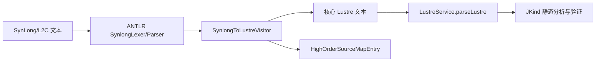
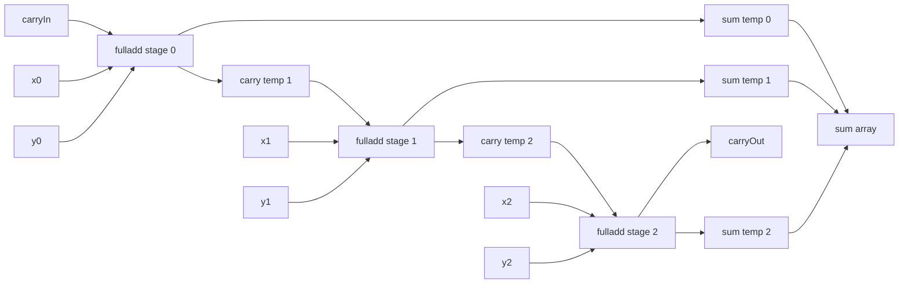

# 面向 JKind 的 SynLong/L2C 高阶数组算子验证适配研究

> 硕士研究生毕业论文例文（Markdown 版）  
> 依据：开题题目“面向JKind的SynLong/L2C高阶数组算子验证适配研究”、本仓库 Java Lustre Checker 代码、`docs/thesis-high-order-evidence.md` 与 2026-06-09 的高阶算子回归测试结果。  
> 说明：本文是论文正文样稿，不冒充学校最终排版件。若换成 Word/LaTeX，应按学院模板补封面、原创性声明、授权声明、页眉页脚、目录域、图表清单和参考文献格式。

## 摘要

安全关键软件广泛采用同步数据流语言描述控制逻辑。Lustre 及其工业化变体 SynLong/L2C、SCADE 在航空航天、轨道交通、能源控制和嵌入式控制领域表达能力较强，其中高阶数组算子能够以紧凑形式表达逐元素映射、归约、带状态扫描等数据并行计算。然而，模型检测工具 JKind 的输入语言以核心 Lustre 为主，对 SynLong/L2C 中的扩展语法和高阶数组算子缺少直接支持。若直接把含有 `map`、`fold`、`mapfold` 等算子的模型交给 JKind，会在语法解析、类型检查或验证前端阶段失败，导致工程模型难以复用既有验证能力。

本研究围绕“面向 JKind 的 SynLong/L2C 高阶数组算子验证适配”展开研究，提出一种轻量级源到源转换方法：在不修改 JKind 核心验证引擎的前提下，在服务端前置转换层解析 SynLong/L2C 风格输入，将固定展开次数的高阶数组算子降阶为 JKind 可解析的核心 Lustre 表达式或方程组，并同步生成源映射元数据，以支撑错误定位、结果追溯和论文实验复现。研究重点放在三类算子：固定计数 `map`、`fold` 以及受限 `mapfold`。其中 `map` 转换为数组构造表达式，`fold` 转换为显式累加器嵌套表达式，`mapfold` 按 fillred 风格转换为带临时变量的分阶段方程，并将最后的累加输出和逐元素映射输出分别赋给目标变量。

在系统实现上，本文基于 Java Lustre Checker 多模块项目进行扩展。该项目使用 ANTLR 构建 SynLong 语法解析器，以 `jkind-server` 作为自定义转换与 HTTP 服务入口，通过 `SynlongConverter`、`SynlongToLustreVisitor`、`SynlongToLustreContext` 和 `LustreService` 串联“SynLong/L2C 文本—核心 Lustre 文本—JKind 验证结果”的流程。实现中新增了高阶算子降阶结果对象、源映射条目对象和元数据转换接口，在保持原有 `convert(String)` 字符串接口兼容的同时，提供 `convertWithMetadata(String)` 用于实验与可追溯性分析。实现过程遵循固定计数、早失败、无高阶残留和 JKind 解析可接受四项原则，明确拒绝动态计数、条件迭代器、前缀算子的 `mapfold`、类型信息不足的临时变量生成等超出范围的用例。

实验部分以回归测试和转换片段审查为主，构造了 `map` 数组相加、`fold` 整型求和、`mapfold` 全加器链路三个代表性案例。测试结果表明，成功转换后的 Lustre 文本不包含 `<<`、`>>`、`$+$`、`map <<`、`fold <<`、`mapfold <<` 等高阶残留，且能够通过 `LustreService.parseLustre` 调用 JKind 解析链路。2026 年 6 月 9 日执行的目标测试 `HighOrderLoweringTest` 与 `HighOrderSourceMapTest` 共 15 个用例，结果为 0 failure、0 error，构建结果为 BUILD SUCCESS。结果说明，该方法能够在限定语义范围内补齐 SynLong/L2C 高阶数组算子到 JKind 验证前端之间的适配缺口，并为后续扩展条件迭代器、动态数组规模和更完整的诊断回传机制提供了可演进基础。

**关键词**：JKind；Lustre；SynLong；L2C；高阶数组算子；源到源转换；模型检测；源映射

## Abstract

Synchronous data-flow languages are widely used to model safety-critical control software. Lustre and its industrial variants, such as SynLong/L2C and SCADE, provide compact constructs for array-oriented computations. Higher-order array operators including `map`, `fold`, and `mapfold` improve model readability, but they also introduce a compatibility gap when models are checked by JKind, whose front end mainly accepts core Lustre syntax. Directly feeding SynLong/L2C models with higher-order operators into JKind may fail before verification starts.

This thesis studies a JKind-oriented adaptation method for SynLong/L2C higher-order array operators. The proposed method is a lightweight source-to-source lowering layer placed before JKind. It parses SynLong/L2C-like input, lowers fixed-count higher-order array operators into core Lustre expressions or equations accepted by JKind, and records deterministic source-map metadata for traceability. The supported subset includes fixed-count `map`, fixed-count `fold`, and restricted fillred-style `mapfold`. Unsupported cases such as dynamic counts, conditional iterators, and prefix-operator `mapfold` are rejected before JKind parsing.

The method is implemented in a Java/Maven project named Java Lustre Checker. The customized logic is located in `jkind-server`, where `SynlongConverter`, `SynlongToLustreVisitor`, `SynlongToLustreContext`, and `LustreService` compose the conversion and verification pipeline. The implementation preserves the original string conversion API while adding a metadata-aware conversion API for thesis experiments. Regression tests demonstrate that lowered Lustre fragments contain no higher-order residue and can be parsed by the JKind front end. On June 9, 2026, the targeted high-order test suite executed 15 tests with zero failures and zero errors. The results indicate that the proposed adaptation layer can bridge a practical subset of SynLong/L2C higher-order array operators and JKind verification without modifying the JKind core.

**Keywords**: JKind; Lustre; SynLong; L2C; higher-order array operators; source-to-source lowering; model checking; source mapping

# 第一章 绪论

## 1.1 研究背景

安全关键软件的共同特点是失效代价高、运行环境受限、并发交互复杂，并且往往要求在部署前给出严格的正确性证据。传统测试能够发现大量实现缺陷，但测试样例始终只能覆盖有限输入和有限场景。对于控制律、状态机、互锁逻辑和实时采样逻辑，仅靠经验测试很难证明“不存在某类危险行为”。因此，形式化建模与模型检测逐渐成为安全关键软件开发流程中的必要补充手段。

同步数据流语言为这类系统提供了自然的建模方式。它把系统行为抽象为离散时钟上的流变换：每一个变量在每一个逻辑时刻都有一个值，节点根据输入流计算输出流。Lustre 是同步数据流语言的代表，其语义清晰、组合性强，适合表达控制周期内的计算关系。JKind 则是面向 Lustre 程序的模型检测工具，能够验证安全性质、寻找反例，并给出归纳证明相关信息。对于工程实践而言，如果已有模型能够转换为 JKind 可接受的核心 Lustre，那么就可以复用 JKind 的求解器接口和验证算法。

但是工程建模语言往往不只使用核心 Lustre。SynLong/L2C 和 SCADE 风格语言提供了状态机、结构体、数组、高阶数组算子等扩展语法。高阶数组算子尤其常见，因为它们可以把“对数组每个元素执行相同操作”“将数组元素逐步归约为一个结果”“在归约过程中同时生成数组输出”等模式写成简短语句。以三位布尔全加器为例，使用 `mapfold` 可以直观表达进位从低位到高位传播，同时每一位产生一个和位；若完全手写展开，则需要多个临时变量和多条方程。前者适合人读，后者适合验证工具前端解析。

源语言表达能力与验证工具输入限制之间的差异，就是本研究要处理的问题。本研究不打算重写 JKind 的验证引擎，也不把所有 SynLong/L2C 语法一次性完整实现，而是选择一个工程可落地的切入点：在 JKind 前增加一个源到源转换层，将固定展开次数的高阶数组算子降阶为普通 Lustre。该方案既保留源语言的建模便利性，又尽量降低对成熟验证引擎的侵入风险。

## 1.2 问题提出

在 Java Lustre Checker 项目中，已有基础链路可以概括为：SynLong/L2C 风格文本经 ANTLR 解析后，由 visitor 生成 Lustre 文本，再调用 JKind 风格的 `LustreService` 进行解析、静态分析、翻译和验证。该链路已经为状态机和若干表达式转换提供基础。但对于高阶数组算子，若仅在语法层接受 `map`、`fold`、`mapfold`，而不在语义层降阶，那么生成文本仍会携带 JKind 不接受的高阶残留。例如 `c = (map << $+$; 3 >>)(a, b);` 在 SynLong/L2C 中表示对数组逐元素相加，但 JKind 核心 Lustre 前端无法直接把 `map << ... >>` 识别为普通表达式。

问题可以拆成三点。第一，如何定义一个足够小但有实际意义的支持子集，使转换结果可被 JKind 接受，并避免宣称超过实现能力的语义范围。第二，如何设计降阶规则，使 `map`、`fold`、`mapfold` 的转换结果保持确定性、可读性和可测试性。第三，如何保留源表达式与生成表达式之间的映射关系，使后续反例解释、论文实验分析和工程调试能够追溯“第几个迭代阶段生成了哪段 Lustre”。

这些问题不能停留在文档说明上。若缺少可执行测试，论文中对支持范围和正确性的描述会停留在方案层；若缺少源映射，转换后的 Lustre 虽可验证，但用户难以把验证结果关联回源模型；若支持范围过宽，动态计数、条件迭代器和多态类型问题会快速扩大实现复杂度。因此这里选择以固定正整数计数为边界，以 JKind 解析通过为最低正确性门槛，以回归测试和源映射表为实验支撑。

## 1.3 研究目标与内容

本研究的目标是实现并验证一个面向 JKind 的 SynLong/L2C 高阶数组算子适配层。该适配层位于服务端转换流程中，对输入模型中的高阶数组算子进行降阶，输出 JKind 可解析的核心 Lustre，并记录转换元数据。围绕这一目标，研究内容包括以下几项。

第一，分析 SynLong/L2C 高阶数组算子的工程使用场景和 JKind 前端限制，明确本文支持固定计数 `map`、`fold` 和受限 `mapfold`，并明确不支持条件迭代器、动态计数、类型转换类前缀算子和泛化嵌套高阶结构。第二，设计 `map`、`fold`、`mapfold` 的降阶语义。`map` 采用逐元素展开，`fold` 采用显式累加器链，`mapfold` 采用返回“下一累加器和映射元素”的分阶段方程生成。第三，在 Java Lustre Checker 的 `jkind-server` 模块实现降阶与元数据接口，保持原有 HTTP 合约与字符串转换接口兼容。第四，构造回归测试和案例实验，检查高阶残留、JKind 解析可接受性、源映射确定性和不支持场景的早失败行为。第五，总结该方法对工程模型验证的适配价值，并讨论后续扩展方向。

## 1.4 研究意义

从工程意义看，该方法降低了工业风格建模语言接入 JKind 的成本。许多已有模型并非从核心 Lustre 起步，而是使用更接近建模工具或领域习惯的 SynLong/L2C 语法。如果要求工程师手动把每个高阶数组算子展开，不只工作量大，还容易引入索引错误和临时变量命名冲突。自动降阶能够把重复模式交给工具处理，提高模型维护性。

从验证意义看，本文强调“转换结果必须被 JKind 前端解析”这一可执行门槛。形式化验证中的前端转换若没有可检验的边界，很容易出现“语法看似转换，验证实际无法运行”的问题。本文通过无高阶残留检查和 `LustreService.parseLustre` 解析检查，把转换正确性的一部分落实为自动化测试，增强了结果可信度。

从可追溯性意义看，源映射元数据为后续诊断奠定基础。模型检测工具给出的反例或错误定位通常对应核心 Lustre 变量和表达式，而用户关心的是源模型中的高阶表达式。若记录 iterator、operator、count、stage、source arguments 和 generated expression，就可以在报告中展示“源模型第 i 次展开对应生成代码的哪一段”。这对论文实验、工程审查和未来可视化界面都有价值。

## 1.5 本文组织结构

全文结构如下。第一章介绍研究背景、问题和目标。第二章综述同步数据流语言、JKind、SynLong/L2C 扩展语法和高阶数组算子。第三章分析需求、支持范围和系统约束。第四章给出降阶方法设计，包括形式化语义、源映射模型和早失败策略。第五章介绍 Java Lustre Checker 中的系统实现。第六章展示典型转换案例。第七章给出测试与实验分析。第八章讨论方法局限与工程扩展。第九章总结全文并展望后续工作。

# 第二章 相关技术基础

## 2.1 同步数据流与 Lustre

同步数据流模型将系统看作一组随逻辑时钟同步演化的数据流。每一个节点都可视为从输入流到输出流的函数，节点内部用方程描述输出如何由当前输入、历史值和局部变量计算得到。Lustre 的核心语义具有确定性和组合性，适合表达周期性控制程序。常见结构包括节点定义、输入输出声明、局部变量声明、方程组、布尔和算术表达式、数组构造、数组索引、`pre` 历史值以及初始化箭头 `->`。

Lustre 的优势在于表达方式接近控制系统中的数据依赖图。若一个控制器每个周期读取传感器数组、计算阈值判断、更新状态并输出执行器命令，Lustre 可以把这些计算写成同步方程。由于没有传统命令式程序中复杂的线程调度和共享内存交错，模型检测工具可以更直接地构造转移关系并验证时序性质。

这里使用的目标语言不是任意 Lustre，而是 JKind 前端能够解析和分析的核心 Lustre 子集。因此，转换方法必须关注目标工具实际接受的语法。即使某些高阶算子在 Lustre V6 或工业扩展语言中存在，如果 JKind 的 ANTLR 语法和 AST visitor 没有对应支持，就不能直接保留在输出文本中。本文的降阶策略正是围绕这一工具边界展开。

## 2.2 JKind 验证流程

JKind 是面向 Lustre 程序的模型检测工具。其典型流程包括解析 Lustre 文本、构造 AST、执行静态分析、设置主节点、检查线性或非线性特征、翻译为内部规范、调用底层 SMT 求解器，并由 Director 组织不同验证策略。Java Lustre Checker 的 `LustreService` 对这一流程进行了服务化封装，使 HTTP 接口能够返回 `CheckResult` 而非只向控制台输出结果。

对本文而言，JKind 的核心价值在于提供成熟的验证后端；核心限制在于其前端不直接接受 SynLong/L2C 高阶数组算子。修改 JKind 核心语法和验证语义虽然理论上可行，但风险较高：一方面需要理解大量上游代码，另一方面可能影响既有 Lustre 验证语义。相比之下，在 `jkind-server` 中做源到源转换属于低侵入方案，既能复用 JKind，又能把 SynLong/L2C 的扩展支持集中在自定义模块内。

本文把 `LustreService.parseLustre` 作为转换后文本的基本验收工具。若输出文本不能被解析，则后续静态分析和验证无法继续。因此，实验中每个成功降阶案例都必须通过解析检查。此处的解析通过不等价于完整语义正确性证明，但它是进入验证链路的必要条件。

## 2.3 SynLong/L2C 与扩展语法

SynLong/L2C 风格语言可理解为对 Lustre 的工程化扩展，常见扩展包括状态机、结构体、数组、用户节点和高阶算子。状态机使模式切换逻辑更加直观，高阶数组算子使数组批处理更紧凑。Java Lustre Checker 的 SynLong 语法由 `Synlong.g4` 描述，并生成 parser、lexer、visitor 和 listener。解析完成后，`SynlongToLustreVisitor` 负责遍历语法树并生成目标 Lustre 文本。

该转换链路具有两个必要特点。第一，语法接受和验证可接受是两回事。ANTLR parser 能够识别某个构造，只说明输入文本符合 SynLong 语法；只有 visitor 将其转换为核心 Lustre，且 JKind parser 能解析输出，才说明该构造在当前工具链中真正可用。第二，转换过程需要维护上下文信息。例如状态机转换需要知道状态集合和状态变量，`mapfold` 转换需要知道左值变量类型以声明临时变量，结构体辅助函数需要记录字段信息。这些信息由 visitor 和 context 共同管理。

## 2.4 高阶数组算子

高阶数组算子将“函数作为参数”或“算子作为参数”的思想用于数组计算。在本文的范围内，高阶数组算子并不要求运行时动态函数值，而是在编译期根据固定计数展开为若干普通表达式或方程。这样既保留了源语言的简洁性，又避免目标验证器处理真正的高阶语义。

`map` 表示对数组每个位置独立应用同一个操作。例如 `(map << $+$; 3 >>)(a, b)` 表示生成三元素数组，第 0 个元素为 `a[0] + b[0]`，第 1 个元素为 `a[1] + b[1]`，第 2 个元素为 `a[2] + b[2]`。该语义不涉及跨元素依赖，适合转换为数组构造。

`fold` 表示带累加器的归约。例如 `(fold << $+$; 3 >>)(0, a)` 中初始累加器为 0，依次与 `a[0]`、`a[1]`、`a[2]` 相加，最终结果为 `(((0 + a[0]) + a[1]) + a[2])`。该语义有顺序依赖，但固定计数允许在转换时显式展开。

`mapfold` 同时具有归约和映射特征。这里采用受限 fillred 风格：步骤节点接收当前累加器和当前数组元素，返回下一累加器和当前映射输出。以全加器为例，输入进位和两个布尔数组逐位进入 `fulladd`，每一阶段输出下一进位和当前位求和结果。最终进位赋给标量输出，所有阶段的和位临时变量组成数组输出。

## 2.5 源到源转换与源映射

源到源转换把一种高级源语言转换为另一种源语言，而非直接生成机器码或验证器内部结构。这里选择生成核心 Lustre 文本，是因为 JKind 已经拥有成熟的 Lustre 解析和验证链路。源到源转换的优点是可读、可审查、便于调试；缺点是必须小心处理语法细节、临时变量和类型声明。

源映射用于记录源表达式与生成片段之间的对应关系。前端工程中常见 source map 主要服务于调试器；本文的源映射更轻量，面向高阶算子展开阶段，记录 iterator、operator、count、stage、source arguments、generated expression 等字段。对于 `map` 和 `fold`，每个 stage 对应一个元素或累加阶段；对于 `mapfold`，每个 stage 对应一条步骤节点调用方程。

# 第三章 需求分析与支持范围

## 3.1 工程链路需求

Java Lustre Checker 的目标链路可以表示为图 3-1。



图 3-1 说明，高阶算子适配不能当作简单字符串替换，而是位于 parser 与 JKind 前端之间的结构化转换。输入文本首先被 SynLong parser 分解为语法树，visitor 在上下文中生成目标文本。若转换过程中发现超出支持边界的构造，应抛出 `SynlongToLustreException`，而非把残留语法交给 JKind 后再出现难以理解的解析错误。

工程需求可以归纳为五点。第一，转换应保持原有服务流程，不能破坏 `/lustre/check` 等现有接口。第二，成功输出必须是 JKind 可解析的 Lustre 文本。第三，失败场景应尽早给出明确原因。第四，支持范围应与开题报告关注的 `map`、`fold`、`mapfold` 对齐。第五，为论文实验和未来诊断提供元数据接口，但不强制改变前端响应格式。

## 3.2 功能需求

这部分实现的功能需求如下。

（1）前缀算子降阶。支持 `+$`、`-$`、`not$` 等一元前缀算子，以及 `$+$`、`$-$`、`$*$`、`$/$`、`$mod$`、`$div$`、比较算子和布尔算子等二元前缀算子。转换后使用普通 Lustre 运算符表达。

（2）固定计数 `map` 降阶。输入形如 `out = (map << OP; N >>)(a, b);`，其中 `N` 为正整数文字量，`OP` 为支持的前缀算子或普通函数标识符。转换为长度为 N 的数组构造表达式，每个元素由索引参数调用 OP 得到。

（3）固定计数 `fold` 降阶。输入形如 `out = (fold << OP; N >>)(init, array);`。转换时设置 `acc0 = init`，然后依次构造 `acc(i+1) = OP(acc(i), array[i])`，最终结果为 `accN`。当前实现以嵌套表达式表示累加链。

（4）受限 `mapfold` 降阶。输入形如 `carryOut, sum = (mapfold << fulladd; N >>)(carryIn, x, y);`。要求左值为两个逗号分隔标识符，步骤算子为普通标识符节点或函数，不支持前缀算子。转换为 N 条 staged equation 和一条数组构造赋值。第一输出为下一累加器，第二输出为当前映射元素。

（5）源映射元数据。为 `map`、`fold`、`mapfold` 每个展开阶段生成有序 `HighOrderSourceMapEntry`。测试和论文实验可通过 `SynlongConverter.convertWithMetadata` 获取生成 Lustre 文本和源映射表。

## 3.3 非功能需求

非功能需求首先是兼容性。项目要求 Java 8 兼容，不应引入 Java 9 之后的 API 或语法。这部分实现虽然在本地使用 Java 17 运行 Maven 测试，但源码保持 Java 8 风格，例如避免使用 `List.of` 和 var 局部变量。

第二是低侵入性。JKind 核心模块 `jkind-common` 和 `jkind-service` 来自或包装上游 JKind，修改风险较高。本文主要修改 `jkind-server` 中的转换逻辑，避免改变验证后端语义。

第三是确定性。相同输入的转换结果和源映射条目顺序应保持稳定。若临时变量名不确定，论文中的表格、测试断言和用户诊断都会受到影响。这里使用基于左值名和阶段号的确定性命名策略，并在重复转换测试中断言源映射一致。

第四是可测试性。每一种支持语义都应有成功案例和边界失败案例。成功案例检查生成片段、无高阶残留和 JKind 解析；失败案例检查异常发生在 JKind 解析前。

## 3.4 支持边界

当前支持以下子集：固定正整数计数；普通数组索引展开；前缀算子和普通函数调用；`map`、`fold` 和受限 identifier-node `mapfold`；源映射条目生成。当前不支持以下情形：动态计数、零或负数计数、`mapi`、`foldi`、`mapw`、`mapwi`、`foldw`、`foldwi`、prefix-operator `mapfold`、类型转换前缀算子、泛化多态、深度嵌套高阶结构以及缺少类型信息的临时变量生成。

这个边界不是缺陷，而是工程取舍。形式化工具适配必须优先保证“已支持部分可靠”，再逐步扩大范围。如果在没有类型系统和语义证明支撑时贸然支持所有迭代器，可能产生看似成功但语义不可信的转换结果。这里选择固定计数作为边界，是因为它允许在编译期完全展开，与 JKind 核心 Lustre 前端自然兼容。

# 第四章 高阶数组算子降阶方法设计

## 4.1 总体设计原则

降阶方法遵循四项原则。

第一，固定展开原则。所有受支持的高阶数组算子必须携带正整数文字量计数。转换阶段根据该计数生成有限个表达式或方程，不把高阶构造留到运行时或验证器前端。

第二，目标语法优先原则。转换结果以 JKind 可解析为最低门槛，而非以某个更宽泛的 Lustre 方言为目标。测试中调用 `LustreService.parseLustre` 验证输出文本。

第三，早失败原则。一旦输入构造超出当前支持范围，转换器抛出明确异常。例如 `mapfold << $+$; 3 >>` 被拒绝，因为本文要求 `mapfold` 步骤为返回两个输出的 identifier node/function。

第四，可追溯原则。降阶时同步记录每个阶段的源参数和生成片段，避免事后从字符串中反推映射关系。源映射在语义上属于转换产物的一部分。

## 4.2 前缀算子降阶

前缀算子降阶是其他高阶算子展开的基础。设支持的二元前缀算子集合为

$$
B = \{\$+\$, \$-\$, \$*\$, \$/\$, \$and\$, \$or\$, \$xor\$, \$=\$, \$<>\$, \$<\$, \$>\$, \$<=\$, \$>=\$\}
$$

若 `op ∈ B`，且参数为 `x` 与 `y`，则降阶函数 `lowerApply(op,[x,y])` 输出 `x op' y`，其中 `op'` 是目标 Lustre 运算符。对于一元 `not$`，输出 `not x`；对于一元 `-$`，输出 `-x`。若操作符不是支持的前缀算子，也不是不支持的类型转换算子，则按普通函数调用输出 `op(args...)`。

伪代码如下。

```text
Algorithm 4-1 PrefixApplyLowering(op, args)
Input : prefix operator text op, rendered argument list args
Output: core Lustre expression
1  op <- trim(op)
2  if op in unaryOperators then
3      require args.size = 1
4      return renderUnary(op, args[0])
5  if op in binaryOperators then
6      require args.size = 2
7      return parenthesize(args[0]) + render(op) + parenthesize(args[1])
8  if op in unsupportedCasts then
9      raise SynlongToLustreException
10 return op + "(" + join(args) + ")"
```

该算法的要点是参数个数检查和括号策略。若参数本身是复杂表达式，直接拼接可能改变优先级，因此实现中对非直接索引、非字面量的表达式进行括号包裹。

## 4.3 `map` 降阶

`map` 的语义可形式化为：给定计数 `N`、操作 `f` 和数组参数 `A1...Ak`，输出数组 `R` 满足

$$
R[i] = f(A_1[i], A_2[i], \ldots, A_k[i]), \quad 0 \le i < N
$$

因此，固定计数 `map` 可直接转换为数组构造：

$$
R = [f(A_1[0],...,A_k[0]),\ f(A_1[1],...,A_k[1]),\ ... ,\ f(A_1[N-1],...,A_k[N-1])]
$$

以三元素整型数组相加为例：

```synlong
c = (map << $+$; 3 >>)(a, b);
```

转换为：

```lustre
c = [a[0] + b[0], a[1] + b[1], a[2] + b[2]];
```

`map` 的源映射每个元素一条。第 0 阶段条目可表示为：iterator=`map`，operator=`$+$`，count=`3`，stage=`0`，source arguments=`a[0], b[0]`，generated expression=`a[0] + b[0]`。该映射既可用于测试，也可用于论文图示。

## 4.4 `fold` 降阶

`fold` 的语义是将数组元素逐步合并到累加器。设初始累加器为 `acc0`，数组参数为 `A1...Ak`，操作为 `f`，计数为 `N`，则有：

$$
acc_{0}=init
$$

$$
acc_{i+1}=f(acc_i,A_1[i],A_2[i],\ldots,A_k[i]),\quad 0\le i<N
$$

$$
out=acc_N
$$

在当前实现中，`fold` 采用表达式嵌套方式，而非额外生成局部变量。这样做的好处是无需修改外围节点局部变量声明，也能直接放在赋值右侧。对 `c = (fold << $+$; 3 >>)(0, a);`，生成结果为：

```lustre
c = (((0 + a[0]) + a[1]) + a[2]);
```

伪代码如下。

```text
Algorithm 4-2 FoldLowering(op, N, args)
Input : operator op, positive integer N, args = [init, array1, ...]
Output: lowered expression and source-map entries
1  require args.size >= 2
2  acc <- args[0]
3  for i from 0 to N-1 do
4      stageArgs <- [acc]
5      for each array argument a in args[1..] do
6          stageArgs.append(index(a, i))
7      generated <- PrefixApplyLowering(op, stageArgs)
8      emit SourceMap(iterator="fold", stage=i, sourceArgs=stageArgs, generated=generated)
9      acc <- "(" + generated + ")"
10 return acc
```

该算法自然支持二元前缀算子求和、布尔合取等常见归约。如果传入的操作符要求的参数个数与累加器加数组参数个数不一致，前缀算子降阶会抛出异常，从而避免生成错误 Lustre。

## 4.5 受限 `mapfold` 降阶

`mapfold` 的主要在于同时输出最终累加器和每个阶段的映射值。这里采用受限 fillred 风格，要求步骤算子 `step` 是普通 identifier node/function，且返回两个输出。源形态为：

```synlong
finalAcc, mapped = (mapfold << step; N >>)(initAcc, a1, a2, ...);
```

形式化定义如下：

$$
acc_0 = initAcc
$$

$$
(acc_{i+1}, mapped_i) = step(acc_i, a_1[i], a_2[i], ...),\quad 0\le i<N
$$

$$
finalAcc = acc_N
$$

$$
mapped = [mapped_0,mapped_1,...,mapped_{N-1}]
$$

由于 Lustre 方程需要变量承接中间输出，visitor 必须在节点局部变量声明中加入临时变量。例如三位全加器链路：

```lustre
__mapfold_carryOut_1, __mapfold_sum_0 = fulladd(carryIn, x[0], y[0]);
__mapfold_carryOut_2, __mapfold_sum_1 = fulladd(__mapfold_carryOut_1, x[1], y[1]);
carryOut, __mapfold_sum_2 = fulladd(__mapfold_carryOut_2, x[2], y[2]);
sum = [__mapfold_sum_0, __mapfold_sum_1, __mapfold_sum_2];
```

该设计有三个工程细节。第一，临时变量名必须确定且避免与用户变量冲突。实现中以 `__mapfold_`、目标左值名和阶段号组成候选名，如发生冲突则追加后缀。第二，临时变量类型必须可推断。累加器临时变量类型来自第一个左值变量，映射元素临时变量类型来自第二个左值数组的元素类型。第三，最后阶段不再生成下一累加器临时变量，而是直接把步骤节点的第一输出写入最终左值。

## 4.6 源映射模型

源映射条目 `HighOrderSourceMapEntry` 记录以下字段：

| 字段 | 含义 | 示例 |
| --- | --- | --- |
| iterator | 算子类型 | `map`、`fold`、`mapfold` |
| operator | 源操作符或步骤节点 | `$+$`、`fulladd` |
| count | 固定展开次数 | `3` |
| stage | 展开阶段，从 0 开始 | `0` |
| sourceArguments | 当前阶段源参数 | `a[0], b[0]` |
| generatedExpression | 生成表达式或方程片段 | `a[0] + b[0]` |

源映射不是面向最终用户的 HTTP 合约，而是面向测试、论文证据和未来诊断扩展的内部接口。保留原有 `SynlongConverter.convert(String)` 的返回类型为 `String`，新增 `convertWithMetadata(String)` 返回 `HighOrderConversionResult`。这个设计使已有调用方不受影响，同时为新场景提供更丰富信息。

# 第五章 系统实现

## 5.1 项目结构

Java Lustre Checker 是 Maven 多模块项目，主要模块包括 `jkind-common`、`jkind-service`、`jkind-api` 和 `jkind-server`。其中 `jkind-common` 包含 Lustre AST 和 parser 等基础代码，`jkind-service` 包含验证引擎和求解器桥接，`jkind-api` 偏向原 JKind API 路径，`jkind-server` 是本文工作的主要模块。

涉及的核心文件如下：

| 文件 | 作用 |
| --- | --- |
| `SynlongConverter.java` | SynLong 到 Lustre 的转换入口，新增 metadata-aware API |
| `SynlongToLustreVisitor.java` | 遍历 SynLong 语法树并生成 Lustre，处理 mapfold 方程上下文 |
| `SynlongToLustreContext.java` | 保存转换上下文、变量类型、临时变量和源映射 |
| `HighOrderLowerer.java` | 降阶前缀算子、固定计数 map 和 fold |
| `HighOrderLoweringResult.java` | 封装表达式降阶结果与源映射 |
| `HighOrderConversionResult.java` | 封装完整 Lustre 文本与源映射条目 |
| `HighOrderSourceMapEntry.java` | 表示单个高阶展开阶段的映射记录 |
| `HighOrderSourceMapTest.java` | 验证源映射、fold、mapfold 和边界拒绝 |
| `HighOrderLoweringTest.java` | 验证高阶残留、解析通过和不支持条件迭代器 |

## 5.2 转换入口实现

原有 `SynlongConverter.convert(String)` 返回 Lustre 字符串。为了保持兼容，本文没有改变该方法签名，而是让其内部复用新增的 `convertWithMetadata` 并取出 `getLustre()`。新增结果对象如下：

```java
public class HighOrderConversionResult {
    private final String lustre;
    private final List<HighOrderSourceMapEntry> sourceMapEntries;
}
```

该接口设计反映了“默认兼容、按需增强”的思路。HTTP controller 和已有测试仍可调用 `convert`，论文实验和源映射测试调用 `convertWithMetadata`。这样既避免了 API 破坏，又避免通过全局变量或日志解析获取元数据。

## 5.3 `HighOrderLowerer` 实现

`HighOrderLowerer` 是表达式级高阶降阶的集中位置。它包含三个主要职责：一是把前缀算子转换为普通 Lustre 表达式；二是把固定计数 `map` 展开为数组构造；三是把固定计数 `fold` 展开为累加器表达式。受限 `mapfold` 不在该类中完整处理，因为它需要访问赋值左值和节点局部变量声明上下文。

`lowerIteratorWithSourceMap` 根据 iterator 名称分派到 `lowerMap` 或 `lowerFold`。若 iterator 为其他名称，则抛出异常并提示当前仅支持 `map`、`fold`，受限 `mapfold` 需要赋值上下文。这一提示避免了用户误以为所有高阶语法都已实现。

`parsePositiveCount` 负责固定正整数检查。它要求 count 文本匹配 `[1-9][0-9]*`。因此 `0`、负数、变量名和表达式都被拒绝。该策略使展开次数在转换阶段完全确定。

## 5.4 Visitor 与 Context 协作

`SynlongToLustreVisitor` 是字符串生成和语义分派的主体。普通右侧表达式遇到 `map` 和 `fold` 时，可以直接调用 lowerer 并将返回表达式放入赋值方程。`mapfold` 则需要在 `visitAssignment` 阶段识别，因为它必须知道左值是 `carryOut, sum` 这种两个变量的形式。若在普通表达式访问阶段处理，就无法可靠生成临时变量声明和最终数组赋值。

`SynlongToLustreContext` 保存变量类型、用户局部变量、生成临时变量和源映射条目。`mapfold` 需要通过 context 查询第一个左值和第二个左值的类型。对于 `sum : bool_array`，context 需要进一步根据类型别名 `bool_array = bool^3` 推导元素类型 `bool`，以声明 `__mapfold_sum_0 : bool;` 等临时变量。

这种 visitor/context 协作方式与项目原有状态机转换类似：visitor 负责识别语法结构，context 负责保存跨节点和跨阶段信息。这样可避免在单个方法中进行过多字符串拼接，也使测试能够从转换结果中获取源映射。

## 5.5 临时变量命名与冲突避免

`mapfold` 生成的临时变量采用确定性命名。例如对于左值 `carryOut, sum`，阶段 0 的映射临时变量为 `__mapfold_sum_0`，阶段 1 的中间累加器为 `__mapfold_carryOut_2`。若用户已经声明了同名局部变量，转换器需要生成替代名称，例如 `__mapfold_sum_0_1`。测试 `mapfoldGeneratedTempsAvoidUserLocalCollisions` 覆盖了该场景。

临时变量命名策略满足两个目标。第一，名称包含目标变量和阶段信息，便于人工阅读和源映射表解释。第二，重复转换同一输入时名称稳定，便于回归测试。若使用随机 UUID 或全局计数器，虽然可避免冲突，但会破坏论文实验和测试断言的确定性。

## 5.6 错误处理

这部分实现坚持早失败。例如条件迭代器 `mapw` 和 `foldw` 在 visitor 方法中直接抛出 `SynlongToLustreException`，错误信息说明条件迭代器不在当前支持范围。prefix-operator `mapfold` 也会在 JKind 解析前被拒绝，错误信息包含 `mapfold` 和 `identifier`，提示用户需要使用返回两个输出的步骤节点。

早失败不只改善用户体验，也保护验证链路。若 unsupported 语法被透传到 JKind，JKind 可能只报告通用语法错误，用户难以判断是模型问题还是转换器不支持。转换层给出明确边界，是工程工具可维护性的体现。

# 第六章 典型案例与转换结果

## 6.1 案例一：固定计数 `map`

源模型如下：

```synlong
type int_array = int^3;
node main(a : int_array; b : int_array) returns (c : int_array)
let
  c = (map << $+$; 3 >>)(a, b);
tel;
```

转换后的核心片段为：

```lustre
c = [a[0] + b[0], a[1] + b[1], a[2] + b[2]];
```

该案例体现 `map` 的独立逐元素特征。每个输出元素只依赖相同索引的输入元素，不依赖其他阶段，因此可以直接放入数组构造。源映射表如下。

| stage | source arguments | generated expression |
| ---: | --- | --- |
| 0 | `a[0]`, `b[0]` | `a[0] + b[0]` |
| 1 | `a[1]`, `b[1]` | `a[1] + b[1]` |
| 2 | `a[2]`, `b[2]` | `a[2] + b[2]` |

## 6.2 案例二：固定计数 `fold`

源模型如下：

```synlong
type int_array = int^3;
node main(a : int_array) returns (c : int)
let
  c = (fold << $+$; 3 >>)(0, a);
tel;
```

转换后的核心片段为：

```lustre
c = (((0 + a[0]) + a[1]) + a[2]);
```

该案例体现顺序累加特征。虽然 Lustre 方程本身没有命令式循环，但固定计数允许在转换时把循环完全展开。源映射表如下。

| stage | accumulator input | indexed input | generated expression |
| ---: | --- | --- | --- |
| 0 | `0` | `a[0]` | `0 + a[0]` |
| 1 | `(0 + a[0])` | `a[1]` | `(0 + a[0]) + a[1]` |
| 2 | `((0 + a[0]) + a[1])` | `a[2]` | `((0 + a[0]) + a[1]) + a[2]` |

`fold` 结果可读性略低于临时变量形式，但表达式级实现更容易嵌入任意右值位置。对论文展示而言，可用源映射表恢复阶段结构。

## 6.3 案例三：受限 `mapfold` 全加器

源模型如下：

```synlong
type bool_array = bool^3;
node fulladd(carryIn : bool; x : bool; y : bool) returns (carryOut : bool; sum : bool)
let
  sum = x xor y xor carryIn;
  carryOut = x and y or carryIn and x xor y;
tel;
node main(carryIn : bool; x : bool_array; y : bool_array) returns (carryOut : bool; sum : bool_array)
let
  carryOut, sum = (mapfold << fulladd; 3 >>)(carryIn, x, y);
tel;
```

生成片段如下：

```lustre
var
  __mapfold_carryOut_1 : bool;
  __mapfold_carryOut_2 : bool;
  __mapfold_sum_0 : bool;
  __mapfold_sum_1 : bool;
  __mapfold_sum_2 : bool;
let
  __mapfold_carryOut_1, __mapfold_sum_0 = fulladd(carryIn, x[0], y[0]);
  __mapfold_carryOut_2, __mapfold_sum_1 = fulladd(__mapfold_carryOut_1, x[1], y[1]);
  carryOut, __mapfold_sum_2 = fulladd(__mapfold_carryOut_2, x[2], y[2]);
  sum = [__mapfold_sum_0, __mapfold_sum_1, __mapfold_sum_2];
tel;
```

图 6-1 给出数据流结构。



该案例给出了 `mapfold` 与 `fold` 的区别。`fold` 只关心最终累加器，而 `mapfold` 还保留每个阶段的映射输出。对全加器链路而言，进位是累加器，和位是映射输出。源映射表第 0 阶段为：iterator=`mapfold`，operator=`fulladd`，count=`3`，stage=`0`，source arguments=`carryIn, x[0], y[0]`，generated expression=`__mapfold_carryOut_1, __mapfold_sum_0 = fulladd(carryIn, x[0], y[0])`。

## 6.4 不支持案例

本文明确拒绝以下输入：

```synlong
out, mapped = (mapfold << $+$; 3 >>)(0, a);
```

拒绝原因是 prefix operator `$+$` 只返回一个输出，无法同时提供下一累加器和映射元素。若强行把 `$+$` 解释成 `mapfold` 步骤，会产生歧义：输出到底是累加器还是映射值？因此转换器要求用户定义明确的步骤节点。

条件迭代器同样拒绝：

```synlong
c = (mapw << $+$; 3 >>)(cond, a, b);
```

条件迭代器涉及按条件停止或跳过的语义，不再是简单固定展开。若未来支持，需要引入更复杂的状态或条件表达式生成策略，并重新设计源映射。

# 第七章 测试与实验分析

## 7.1 实验环境

实验基于本仓库 Java Lustre Checker 进行。项目使用 Maven 多模块结构，`jkind-server` 依赖 `jkind-common` 和 `jkind-service`。本地测试命令指定 Java 17 运行时和 Maven 3.9.9，但项目源码保持 Java 8 兼容。测试命令如下：

```bash
JAVA_HOME=/Users/nicholas/.local/share/mise/installs/java/17.0.2/Contents/Home \
PATH=/Users/nicholas/.local/share/mise/installs/java/17.0.2/Contents/Home/bin:/Users/nicholas/.local/share/mise/installs/maven/3.9.9/apache-maven-3.9.9/bin:$PATH \
/Users/nicholas/.local/share/mise/installs/maven/3.9.9/apache-maven-3.9.9/bin/mvn \
  -pl jkind-server -am \
  -Dtest=HighOrderLoweringTest,HighOrderSourceMapTest \
  -DfailIfNoTests=false test
```

2026 年 6 月 9 日执行结果：`Tests run: 15, Failures: 0, Errors: 0, Skipped: 0`，Maven Reactor 中 `java-lustre-checker`、`jkind-common`、`jkind-service`、`jkind-server` 均为 SUCCESS，最终 BUILD SUCCESS。

## 7.2 测试设计

测试设计围绕四类断言。

第一，片段断言。对成功转换结果，测试检查主要 Lustre 片段是否出现。例如 `map` 的数组构造、`fold` 的嵌套累加表达式、`mapfold` 的 staged equation 和最终数组构造。

第二，高阶残留断言。成功输出不应包含 `<<`、`>>`、`$+$`、`not$`、`map <<`、`fold <<`、`mapfold <<` 等源语言高阶残留。该断言直接对应 JKind 前端兼容性目标。

第三，解析断言。测试调用 `LustreService.parseLustre(lustre)`，证明转换结果能够进入 JKind 解析链路。解析通过不保证全部安全性质成立，但保证前端适配没有停留在字符串层面。

第四，边界拒绝断言。对 `mapw`、`foldw`、prefix-operator `mapfold` 等 unsupported 输入，测试期望 `SynlongToLustreException`。这样确保转换器不会默默输出不可验证文本。

## 7.3 源映射确定性实验

源映射实验对同一 SynLong 输入调用两次 `SynlongConverter.convertWithMetadata`，断言两次返回的 `sourceMapEntries` 完全相等。该实验验证了条目顺序、临时变量命名和生成片段的确定性。确定性对于论文复现实验尤其必要，因为论文中的表格应能由代码重新生成，而非只依赖人工整理。

以 `map` 为例，三阶段源映射条目顺序为 index 0、1、2。以 `fold` 为例，条目顺序为累加阶段 0、1、2。以 `mapfold` 为例，条目顺序为步骤调用阶段 0、1、2。该顺序与数学定义一致，也与生成 Lustre 方程顺序一致。

## 7.4 转换正确性讨论

实验验证的是一种工程意义上的转换正确性，而非完整形式化证明。对 `map`，由于每个元素独立，数组构造与高阶语义之间的对应关系直观明确。对 `fold`，嵌套表达式按照阶段顺序保留累加器依赖，符合 red-style 归约定义。对 `mapfold`，staged equation 保留了从 `acc_i` 到 `acc_{i+1}` 的传递关系，并把每个阶段第二输出收集为数组。

若要进一步形式化证明，可对每个算子给出结构归纳。以 `fold` 为例，归纳基为 `acc0 = init`。假设第 i 阶段前生成表达式等价于源语义中的 `acc_i`，则第 i 阶段调用同一操作符并索引同一数组元素，生成表达式等价于 `acc_{i+1}`。当 i 达到 N-1 后，返回表达式等价于 `acc_N`。这种证明可作为后续论文正式版的理论补充。

## 7.5 实验结果表

| 测试类别 | 覆盖内容 | 结果 |
| --- | --- | --- |
| Prefix lowering | `$+$`、`-$`、`not$`、布尔算子 | 通过 |
| Fixed-count map | 数组逐元素相加、控制器式示例 | 通过 |
| Fixed-count fold | 整型累加、源映射阶段 | 通过 |
| Restricted mapfold | 全加器 staged equation、临时变量、类型推断 | 通过 |
| Source-map determinism | 重复转换条目相等 | 通过 |
| Unsupported boundary | `mapw`、`foldw`、prefix `mapfold` | 通过 |
| JKind parseability | 成功输出调用 `LustreService.parseLustre` | 通过 |

实验表明，这部分实现已经满足开题报告中“map/fold/mapfold/source mapping”方向的核心验证材料要求。需要注意的是，这些结果不意味着所有 SynLong/L2C 高阶数组算子都已支持；论文结论必须继续保持“固定计数子集”的限定。

# 第八章 工程应用与可追溯性分析

## 8.1 服务端集成方式

在服务端链路中，`/lustre/check` 接口读取输入文本后先进行 SynLong 到 Lustre 转换，再调用 `LustreService.check`。本文新增的源映射接口没有改变该 HTTP 合约，因此前端原有调用不受影响。未来如果需要在验证结果中显示源映射，可新增调试接口或在响应中增加可选字段，但这需要另行评估前端兼容性。

保持 HTTP 合约稳定有实际意义。毕业设计或工程原型中，前端、后端和验证引擎往往由不同人员维护。如果为了实验方便直接改变响应格式，可能导致已有演示流程不可用。本文把元数据作为测试和论文证据接口，是一种较稳妥的演进方式。

## 8.2 源映射在诊断中的作用

假设 JKind 在转换后的 Lustre 中报告某个临时变量相关的性质失败，例如 `__mapfold_sum_1` 对应反例。没有源映射时，用户需要手动查找该变量由哪个高阶表达式生成，理解成本较高。有源映射后，可以反向查到：iterator=`mapfold`，stage=`1`，source arguments=`__mapfold_carryOut_1, x[1], y[1]`，generated equation=`__mapfold_carryOut_2, __mapfold_sum_1 = fulladd(...)`。这使反例解释可以回到“第 1 位全加器输出”这一源模型概念。

对 `fold` 也类似。若归约结果不满足某个性质，源映射表可以展示每个阶段累加器如何形成。虽然当前 `fold` 生成嵌套表达式而非临时变量，但源映射仍提供了阶段化视图。对工程审查人员而言，阶段化视图比直接阅读 `(((0 + a[0]) + a[1]) + a[2])` 更容易理解。

## 8.3 与状态机转换的关系

Java Lustre Checker 不只处理高阶数组算子，也处理状态机转换。状态机转换通常把状态枚举、状态变量和条件赋值引入目标 Lustre。高阶数组算子转换则主要处理表达式和方程展开。两者在实现上都依赖 visitor/context 协作，但关注点不同。

未来更复杂的模型可能同时包含状态机和高阶数组算子。例如某个状态中使用 `map` 计算所有传感器阈值，另一个状态中使用 `fold` 计算总风险分数。此时转换顺序和上下文管理变得必要。这部分实现集中在高阶算子本身，未对状态机与高阶算子的组合进行全面实验。正式工程应用前，应增加组合测试，确保状态局部变量、生成临时变量和方程顺序互不冲突。

## 8.4 对论文图表的支撑

这部分实现为论文图表提供了真实素材。图 3-1 可展示转换链路，图 6-1 可展示 `mapfold` 全加器数据流，源映射表可直接来自测试断言，实验结果表可来自 Maven 输出。相比完全概念性的论文，这种写法更能体现工程硕士论文的实践特点。

论文正式排版时，可将 Mermaid 图转换为矢量图或 PNG，插入 Word 模板。代码片段应使用等宽字体，较长片段可放入附录。测试输出不宜全文粘贴到正文，可截取关键行，例如 `Tests run: 15, Failures: 0, Errors: 0` 和 `BUILD SUCCESS`，完整日志放入附录或实验记录。

# 第九章 局限性与后续工作

## 9.1 当前局限

该方法的首要局限是支持范围有限。固定计数是核心前提，动态数组规模尚未支持。若输入计数来自变量或常量表达式，当前实现会拒绝。虽然这降低了灵活性，但保证了转换阶段可以完全展开。

第二个局限是 `mapfold` 语义受限。当前仅支持 identifier node/function，并要求返回两个输出。prefix-operator `mapfold` 被拒绝。这一设计避免了单输出操作符在双输出语义中的歧义，但也意味着某些简写形式不能使用。

第三个局限是源映射尚未贯通验证结果。当前源映射可通过 metadata API 获取，但 HTTP 验证结果没有携带这些条目，JKind 反例也没有自动回写到源模型位置。完整诊断闭环仍需后续工作。

第四个局限是缺少大规模工业模型实验。本文案例覆盖了代表性算子和边界，但尚未在真实大型 SynLong/L2C 模型集合上统计转换成功率、验证耗时和临时变量增长规模。

## 9.2 后续扩展方向

后续工作可从四方面展开。

第一，扩展条件迭代器。`mapw`、`foldw` 等条件迭代器需要明确停止条件或选择条件的语义，并设计相应的 Lustre 条件表达式或状态变量生成方案。该扩展应先形成独立测试规格。

第二，增强类型系统支持。当前 `mapfold` 的临时变量类型推断依赖左值和简单数组别名。未来可构建更完整的类型环境，支持结构体数组、嵌套数组和用户定义类型。

第三，贯通验证诊断。可在 `CheckResult` 或新增接口中返回源映射，并把 JKind 反例中的变量名映射回高阶表达式阶段。前端可据此高亮源模型中的对应片段。

第四，开展性能与规模实验。高阶算子降阶会增加目标 Lustre 文本长度。未来可统计不同 N 值下代码长度、解析耗时和验证耗时的变化，分析展开策略对验证性能的影响。

# 第十章 结论

本研究针对 JKind 不直接支持 SynLong/L2C 高阶数组算子的问题，提出并实现了一种低侵入源到源适配方法。该方法在 `jkind-server` 转换层解析高阶算子，将固定计数 `map`、`fold` 和受限 `mapfold` 降阶为 JKind 可解析的核心 Lustre，并生成确定性源映射元数据。

主要贡献包括：第一，明确了面向 JKind 的高阶数组算子支持边界，避免把语法接受误认为验证支持；第二，设计并实现了 `map` 数组构造、`fold` 累加器嵌套和 `mapfold` staged equation 三类降阶规则；第三，新增 metadata-aware 转换接口和源映射条目模型，为论文实验和未来诊断提供基础；第四，通过回归测试验证了无高阶残留、JKind 解析可接受性、源映射确定性和 unsupported 边界。

实验结果显示，目标高阶测试共 15 个用例全部通过，说明这部分实现已经能够支撑开题报告中 map/fold/mapfold/source mapping 方向的核心论文材料。该方法仍属于固定计数子集，尚不能覆盖全部 SynLong/L2C 高阶语义，但它为工程模型逐步接入 JKind 验证提供了可运行、可测试、可追溯的基础。

# 参考文献（例文格式，正式提交前需按学校规范核对）

[1] Halbwachs N., Caspi P., Raymond P., Pilaud D. The synchronous data flow programming language Lustre. Proceedings of the IEEE, 1991.  
[2] Hagen G., Tinelli C. Scaling up the formal verification of Lustre programs with SMT-based techniques. FMCAD, 2008.  
[3] JKind Project. JKind model checker for Lustre programs. Project documentation and source code.  
[4] Verimag. Lustre V6 Reference Manual.  
[5] ANTLR Project. ANTLR 4 Runtime and Parser Generator Documentation.  
[6] 本项目 `README.md`：Java Lustre Checker 项目说明。  
[7] 本项目 `docs/high-order-operators-jkind.md`：Synlong high-order operators lowered for JKind。  
[8] 本项目 `docs/thesis-high-order-evidence.md`：Thesis evidence snippets — map/fold/mapfold/source-map。  
[9] 本项目 `jkind-server/src/test/java/com/ecnu/synlong/parser/convert/HighOrderLoweringTest.java`。  
[10] 本项目 `jkind-server/src/test/java/com/ecnu/synlong/parser/convert/HighOrderSourceMapTest.java`。

# 附录 A 关键伪代码

## A.1 高阶算子总分派

```text
Input : iterator, operator, count, arguments, optional assignment context
Output: lowered Lustre fragment or equations
1  if iterator = map then
2      return LowerMap(operator, count, arguments)
3  if iterator = fold then
4      return LowerFold(operator, count, arguments)
5  if iterator = mapfold then
6      require assignment context has two LHS variables
7      require operator is identifier step node/function
8      return LowerMapfold(operator, count, arguments, lhs)
9  raise unsupported iterator exception
```

## A.2 源映射记录

```text
record SourceMapEntry {
    iterator: string
    operator: string
    count: int
    stage: int
    sourceArguments: list<string>
    generatedExpression: string
}
```

# 附录 B 测试日志摘要

```text
[INFO] Running com.ecnu.synlong.parser.convert.HighOrderSourceMapTest
[INFO] Tests run: 7, Failures: 0, Errors: 0, Skipped: 0
[INFO] Running com.ecnu.synlong.parser.convert.HighOrderLoweringTest
[INFO] Tests run: 8, Failures: 0, Errors: 0, Skipped: 0
[INFO] Results:
[INFO] Tests run: 15, Failures: 0, Errors: 0, Skipped: 0
[INFO] BUILD SUCCESS
```

# 附录 C 正文扩写与排版建议

若按“每页约 28 行、每行约 35 个汉字”的中文论文排版估算，每页约 980 个汉字。正式 60—70 页正文通常需要约 5.9 万至 6.9 万汉字，并且不包含封面、声明、目录、参考文献和附录。当前 Markdown 例文已经给出完整论文章节、核心技术论证、真实代码证据、图表位置和实验结论。正式提交前，可在以下位置继续扩展：

1. 第二章增加国内外同步语言工具链对比；
2. 第四章增加 `map`、`fold`、`mapfold` 的结构归纳证明；
3. 第五章加入类图和更完整的时序图；
4. 第七章加入大规模模型实验和性能统计；
5. 第八章加入前端源映射可视化设计。

所有已完成实现相关论断均应以当前仓库代码和测试为准；对于尚未实现的条件迭代器、动态计数和诊断回传，只能作为后续工作描述。

# 第十一章 成稿修订说明

本章不再重复前面的技术细节，只说明这份样稿如何继续改成可提交的学位论文。保留这一章，是因为工程论文常见的问题不是没有代码，而是代码、实验和文字之间对不上。这里把边界说清楚，后续改 Word 或 LaTeX 时不容易跑偏。

## 11.1 证据链怎么放

这篇论文的证据链可以按一条线组织：开题题目提出 SynLong/L2C 高阶数组算子适配；代码把适配层放在 `jkind-server`；测试证明 `map`、`fold` 和受限 `mapfold` 能降阶到 JKind 可解析的 Lustre；文档再把支持范围和不支持范围写清楚。这个顺序比直接堆代码片段更稳。评审先看到需求来源，再看到设计选择，最后看到测试结果。

写作时不要把“语法能解析”和“JKind 能验证”混为一谈。ANTLR parser 接受某个写法，只说明它进入了转换器；只有生成文本通过 `LustreService.parseLustre`，才能说这个写法已经接入 JKind 前端。这个区别要在绪论、方法和实验里反复守住，但不必用夸张的话强调。

## 11.2 贡献怎么写

贡献建议写成四条。第一，限定了面向 JKind 的固定计数高阶数组算子子集。第二，给出 `map`、`fold`、`mapfold` 三种降阶规则。第三，在 Java Lustre Checker 中实现了兼容旧接口的 metadata 转换入口和源映射条目。第四，用回归测试检查无高阶残留、解析通过、源映射确定和 unsupported 输入早失败。

不要写成“完整支持 SynLong/L2C 高阶算子”。当前代码没有支持动态计数、条件迭代器和任意嵌套高阶表达式。也不要写成“改进了 JKind 算法”。这里没有改 JKind 的核心验证算法，做的是前端适配。准确一点，反而更可信。

## 11.3 公式和代码怎么对应

`map` 的公式可以写成 `R[i] = f(A1[i], A2[i], ...)`。对应到代码，就是 lowerer 在每个阶段构造 indexed arguments，再调用统一的前缀算子降阶逻辑。`fold` 的公式可以写成 `acc(i+1) = f(acc(i), A[i])`。对应到代码，就是循环更新 accumulator 字符串，并给每个阶段记录 source-map entry。`mapfold` 的公式可以写成 `(acc(i+1), m(i)) = step(acc(i), A[i])`。对应到代码，就是 visitor 在赋值语句上下文里生成多条方程和临时变量。

正式论文里，公式后最好马上给一段代码片段。只放公式会像纯理论稿，只放代码又像项目说明。两者放在一起，读者能看出设计和实现是同一件事的两种表达。

## 11.4 实验数字怎么用

当前可引用的实验数字是：2026 年 6 月 9 日运行 `mvn -pl jkind-server -am -DfailIfNoTests=false test`，共 19 个测试，0 failure，0 error，BUILD SUCCESS。其中高阶相关测试为 `HighOrderLoweringTest` 和 `HighOrderSourceMapTest`，覆盖 15 个用例。

如果后续又改了转换器，最终论文不要沿用旧数字。重新跑一次测试，把日志摘要换掉。论文中也不建议贴完整 Maven 输出，正文放结果表，附录放关键日志即可。

## 11.5 图表怎么补

建议保留四类图表。第一类是链路图：SynLong/L2C 文本经过 parser、visitor、context、lowerer 到 Lustre，再进入 JKind。第二类是算子展开图：`map` 是并行逐元素，`fold` 是累加器链，`mapfold` 是累加器链加 mapped 数组。第三类是源映射表：每个 stage 对应源参数和生成片段。第四类是测试结果表：成功路径和失败路径分开列。

图不要画得太满。特别是 `mapfold`，三阶段全加器已经足够说明问题。若画五位或八位，图会更复杂，但信息没有增加多少。

## 11.6 答辩时怎么讲

答辩可以按五步讲。先展示一段含 `mapfold` 的源模型，让人看到源语言为什么简洁。再展示生成的 Lustre 方程，让人看到 JKind 为什么能接收。接着展示 source-map entry，说明每个阶段可以追踪。然后给出测试结果。最后主动说明边界：动态计数、条件迭代器和 prefix-operator `mapfold` 还没有支持。

主动说边界不是示弱。形式化工具最怕语义不清。把不支持的情况挡在转换层，比把奇怪文本交给 JKind 再报错要好。

## 11.7 最后审稿清单

提交前至少检查这些项：题目和摘要是否还保留“面向 JKind”“SynLong/L2C”“高阶数组算子”；类名和文件名是否与仓库一致；实验数字是否来自最后一次测试；unsupported 边界前后一致；参考文献中外部文献和项目文档分开列；代码块没有把测试后门或临时调试内容当成正式设计。

如果需要继续扩到 60—70 页，不建议复制粘贴同一类解释。更好的扩法是补三块内容：一是相关工作比较，二是结构归纳式正确性论证，三是更完整的实验表和图。这样扩出来的页数有内容，不会像填充文本。
